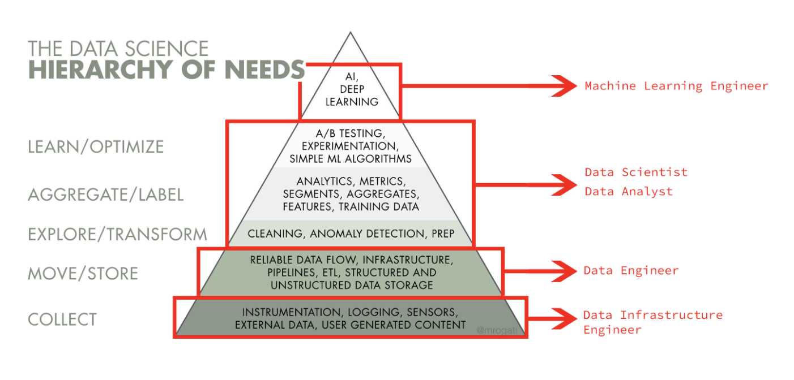

### ML Engineering For Enterprise grade ML

 ML Engineering = Machine learning systems design + Data Engineering + ML Ops 

### Motivation: 

With 2,3 trillion gigabytes of data created each day, companies have access to a broad range of information on their users, market and much more.
This Data allows them to constantly improve their product/service. 

- At early stage start-ups: the primary analytic focus is to implement logging, to build ETL processes, to model data and design schemas so data can be tracked and stored. The goal here is focused on building the analytics foundation rather than analysis itself
- At mid-stage growing start-ups: Since the company is growing, the data is probably growing too. The data platform needs to adapt, but with the foundation laid out already, there will be a natural shift to insight generation. Unless the company leverages Data Science for its strategic differentiation to start with, many analytics work are around defining KPI, attributing growth, and finding the next opportunities to grow
- Companies who achieved scale: When the company scales up, data also scales up. It needs to leverage data to create or maintain competitive edge. e.g. Search results need to be better, recommendations need to be more relevant, logistics or operations need to be more efficient — this is the time where specialist like ML engineers, Optimization experts, Experimentation designers can play a huge role in stepping up the game.

Before we can do data science we need to setup the infrastructure

Developing an AI project development life cycle involves five distinct tasks:

-  Data engineering: People responsible for data engineering prepare data
and transform data into formats that other team members can use.
-  Modeling: People assigned to modeling look for patterns in data that can
help a company predict outcomes of various decisions, identify business risks
and opportunities, or determine cause-and-effect relationships.
-  Deployment: People in charge of deployment take a stream of data, combine it
with a model, and test the integration before putting the model into production.
-  Business analysis: Team members responsible for business analysis evaluate a deployed
model’s performance and business value and adjust accordingly to maximize benefit or abandon unproductive models.
-  AI infrastructure: People who work in AI infrastructure build and maintain reliable, fast, secure, and scalable software
systems to help people working in data engineering, modeling, deployment and business analysis.

------

About/Scope: 

- We present an iterative framework for designing real-world machine learning systems. 
-  We take a system level view of things and architect a solution based on  business requirements where the end goal of this framework is to build a system that is deployable, reliable, and scalable.
- Enterprise grade ML, a term mentioned in [a paper put forth by Microsoft](https://arxiv.org/abs/1909.00084), refers to ML applications where there is a high level of scrutiny for data handling, model fairness, user privacy, and debuggability. While toy problems that data scientists solve on laptops using a csv dataset could be intellectually challenging, they are not enterprise grade machine learning problems.
- In deployment (via containers or spark applications, for example), governance becomes paramount, especially in regulated environments. Data lineage, data versioning, model versioning, model explainability, model monitoring are all front and center.
- Examples of System Design/Data Engineering tasks include: 
  - Ingest data from a data source
  - Build and maintain a data warehouse 
  - create a data pipeline 
  - create an analytics table for a specific use case 
  - migrate data to cloud 
  - schedule and automate pipelines 
  - backfill data 
  - debug data quality issues 
  - optimize queries 
  - design a database

| Task/Topic                                         | Description of sub-tasks/Topics                              | Selected Tools                                            | Theory/Notes                                                 | Example Code                                                 |
| -------------------------------------------------- | :----------------------------------------------------------- | --------------------------------------------------------- | ------------------------------------------------------------ | ------------------------------------------------------------ |
| Frame the problem and Acquire data                 | 1. Identify areas of business that can benifit from machine learning   2. Translating a business problem into a machine learning problem. e.g supervised learning  3. Pick a sucess criteria - How would performance be measured?   |                                                           |                                                              |                                                              |
| Data Storage and Modeling (revise)                 | 1.  Acquire relvant data - estiamte space and engineering effort - setup a data version control system   2. Creating a data model  to store data and facilitating access by other team members   3.  Setup Cloud Data Warehouses - Kimball methodology.   4. Design a database - Relational Data Models (Postgres)   5. Document Model - NoSQL Data Models | POSTGRES, mongoDB, AWS - S3                               |                                                              |                                                              |
| Data Acquizition                                   | Ingest data from a data source e.g Querying data- Pulling data from a database (SQL or NOSQL) or Call S3 API | POSTGRES, mongoDB, AWS - S3                               |                                                              |                                                              |
| Data Exploration                                   | Which features are categorical/Numerical?   Which features contain blank, null or empty values?  What are the data types for various features?  What is the distribution of numerical feature values across the samples? What is the distribution of categorical features? Study correlation between a given target variable and all other variables Visual Data Analysis:  Applying a dimensionality reduction on a dataset to facilitate model training or gather insights | Pandas, Matplotlib                                        |                                                              |                                                              |
| Data Cleaning                                      | Handle Missing values Handle Outliers/erronous data Get into Tidy data | Pandas, Apache Spark                                      | [Spark Notes](https://asjadkhan.ghost.io/ghost/#/editor/post/5f39c86010c8da00398dc9ce) | [ML_Course](https://github.com/asjad99/Machine-Learning-GYM) |
| Data Preparation/Feature Engineering               | Feature Selection Feature Encoding   Add new promosing transformations of features   Aggregate features into promosing new features |                                                           | [ML_Course](https://github.com/asjad99/Machine-Learning-GYM) | [ML_Course](https://github.com/asjad99/Machine-Learning-GYM) |
| Training models                                    | Using one of the following methods: Linear Regression, Logistic Regression, Decision Trees, Random Forest, XGBoost, Support Vector Machines, K-means, K-Nearest Neighbors, Neural Networks, Principal Component Analysis, Naive Bayes Classifier, Lasso/Ridge regression, etc.  Implementing evaluation metrics such as accuracy, precision, recall, intersection over union, or mean average precision (mAP)Grid Search and Cross Validation | scikit-learn                                              | [ML_Course](https://github.com/asjad99/Machine-Learning-GYM) | [ML_Course](https://github.com/asjad99/Machine-Learning-GYM) |
| Training Deep Learning Models                      | Using deep learning for a domain-specific application such as fraud detection, text summarization, machine translation, speech recognition, or object classification, detection, or segmentation   Tuning hyperparameters involved in neural network optimization   Organizing experiments to get results in the shortest time period    Setting up hyperparameter search experiments using tools such as AutoML | TensorFlow, and PyTorch                                   |                                                              |                                                              |
| Data Pipelines                                     | Building and maintaining the organization’s data pipeline systemsimplementing ETL (or ELT) best practices at scale.  e.g build an ETL pipeline that extracts data from S3, stages them in Redshift, and transforms data into a set of dimensional tables for their analytics team.`Designing an ETL system | Airflow                                                   |                                                              |                                                              |
| Distributed or Accelerating training               | Setting up code to train a model on multiple machines in parallel |                                                           |                                                              |                                                              |
| Stream Processing                                  | Converting a continuous feature into a categorical feature using bucketing | Spark Streaming , Kafka, AWS Kinesis (Realtime Streaming) |                                                              |                                                              |
| Setting up a cloud environment to deploy the model | Converting prototyped code into production code  Mastering cloud tools and infrastructure Preparing files (usually model architecture and parameters) for deployment  Encrypting files that store model parameters, architecture, and data  Setting up load-balancing requirements with engineers in charge of AI Infrastructure  Pruning or quantizing a model so it fits memory requirements | AWS                                                       |                                                              |                                                              |
| Present / Launch Solution                          | Building APIs for an application to use a model -  Setting up HTTP RESTful API services to facilitate productionize   Setting up authorization and authentication to access the API | **Flask etc**                                             |                                                              |                                                              |

### 

---

### Resources:

- [Stanford Machine Learning Systems Design](https://stanford-cs329s.github.io/syllabus.html)
- [book] Designing Data-Intensive Applications by Martin Kleppmann
- [Machine Learning system design - book draft](https://huyenchip.com/machine-learning-systems-design/toc.html)
- [System Design for Large Scale Machine Learning](https://shivaram.org/publications/shivaram-dissertation.pdf)
- [Stanford MLSys Seminars](https://www.youtube.com/channel/UCzz6ructab1U44QPI3HpZEQ)
- [Book - The Data Engineering Cookbook](https://github.com/andkret/Cookbook)
- Github - [Awesome Data-Engineering](https://github.com/igorbarinov/awesome-data-engineering)
- Github- [How To Become a Data Engineer](https://github.com/adilkhash/Data-Engineering-HowTo)
- Github - [Nanodegree Projects](https://github.com/Flor91/Data-engineering-nanodegree)
- GITHUB - [Nanodegree project 2](https://github.com/san089/Udacity-Data-Engineering-Projects)
- Is dataFrame just a table
- https://www.mikealche.com/software-development/a-humble-guide-to-database-schema-design
- SQL Mastery
- (AIEngineering)[https://www.youtube.com/channel/UCwBs8TLOogwyGd0GxHCp-Dw]  
- List of Tools for [MLOps](https://docs.google.com/spreadsheets/d/1i8BzE4puGQ3dmQueu4LQCcwaqrulgK1Vb-xeFwhy6gY/edit)
- [System Design Primer] https://github.com/donnemartin/system-design-primer
- 

### Interesting Articles/Case Studies: 

- https://huyenchip.com/machine-learning-systems-design/case-studies.html#case-studies-bYrWS80

- https://medium.com/refraction-tech-everything/how-netflix-works-the-hugely-simplified-complex-stuff-that-happens-every-time-you-hit-play-3a40c9be254b

  

----

### Nice to have skills: 

| Task                                       | Description                                                  |
| ------------------------------------------ | ------------------------------------------------------------ |
| **Containers**                             | KubernetesDocker                                             |
| **Create** **Data Lakes with Spark**       | Data Wrangling with Spark ` Setting up Spark Cluster with AWS Debugging and Optimisation`Intro to data lakes ` |
| **Feature Store**                          | kind of an in-memory database such that at real time inference we have model features readily available |
| **Speeding up model prediction time**      | - Applying techniques such as pruning, quantization, or compression to reduce memory requirements - Running inference speed vs. accuracy experiments on a model |
| **Primer on distributed systems**          | ReplicationPartitioningTransactionsConsistency and Consensus |
| Deal wit constantly shifting distributions | Data Drift :your real world dataset would not always have same distribution. For example the way a person shops in spring would be different than that of winter. So when you train a model on spring data set and deployed it you cant test it when winters come. So the data type is drifted away from normal and this is something to keep an eye Model Drift:now when your model is deployed and you start making predictions online (realtime) with passage of time due to data drift your model performance will de-grade and you would need to keep track of those changes. you would need to re train your model on latest dataset and then re-deploy it |