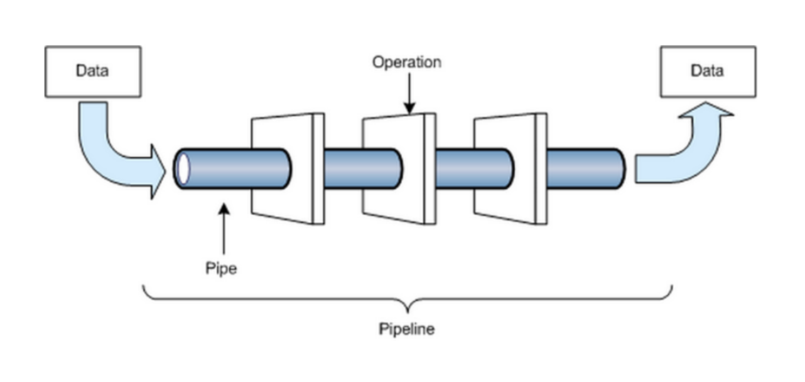

# ML Engineering Labs

### About: 
With 2,3 trillion gigabytes of data created each day, companies have access to a broad range of information on their users, market and much more.
This Data allows them to constantly improve their product/service. 

- At early stage start-ups: the primary analytic focus is to implement logging, to build ETL processes, to model data and design schemas so data can be tracked and stored. The goal here is focused on building the analytics foundation rather than analysis itself
- At mid-stage growing start-ups: Since the company is growing, the data is probably growing too. The data platform needs to adapt, but with the foundation laid out already, there will be a natural shift to insight generation. Unless the company leverages Data Science for its strategic differentiation to start with, many analytics work are around defining KPI, attributing growth, and finding the next opportunities to grow
- Companies who achieved scale: When the company scales up, data also scales up. It needs to leverage data to create or maintain competitive edge. e.g. Search results need to be better, recommendations need to be more relevant, logistics or operations need to be more efficient — this is the time where specialist like ML engineers, Optimization experts, Experimentation designers can play a huge role in stepping up the game.

Before we can do data science we need to setup the infrastructure

Developing an AI project development life cycle involves five distinct tasks:

-  Data engineering: People responsible for data engineering prepare data
and transform data into formats that other team members can use.
-  Modeling: People assigned to modeling look for patterns in data that can
help a company predict outcomes of various decisions, identify business risks
and opportunities, or determine cause-and-effect relationships.
-  Deployment: People in charge of deployment take a stream of data, combine it
with a model, and test the integration before putting the model into production.
-  Business analysis: Team members responsible for business analysis evaluate a deployed
model’s performance and business value and adjust accordingly to maximize benefit or abandon unproductive models.
-  AI infrastructure: People who work in AI infrastructure build and maintain reliable, fast, secure, and scalable software
systems to help people working in data engineering, modeling, deployment and business analysis.

| Task                                               | Description of sub-tasks                                                                                                                                                                                                                                                                                                                                                                                                                                      | Selected Tools                                                                                      | Theory/Notes                                                                           | Example Code                                                 |
| -------------------------------------------------- | ------------------------------------------------------------------------------------------------------------------------------------------------------------------------------------------------------------------------------------------------------------------------------------------------------------------------------------------------------------------------------------------------------------------------------------------------------------- | --------------------------------------------------------------------------------------------------- | -------------------------------------------------------------------------------------- | ------------------------------------------------------------ |
|                                                    | - Translating a business problem into a machine learning problem                                                                                                                                                                                                                                                                                                                                                                                              |                                                                                                     |                                                                                        |                                                              |
| Data Acquizition                                   | -  Creating a data model  to store data and facilitating access by other team members  - Querying data- Pulling data from a database (SQL or NOSQL)                                                                                                                                                                                                                                                                                                        | - Relational Data Models (Postgres) - Document Model - NoSQL Data Models (mongoDB) - AWS - S3 |                                                                                        |                                                              |
| Data Exploration                                   | - Exploration via Data visualization  - Applying a dimensionality reduction on a dataset to facilitate model training or gather insights                                                                                                                                                                                                                                                                                                                   | Pandas, Matplotlib                                                                                  |                                                                                        |                                                              |
| Data Cleaning                                      | - Get into Tidy data                                                                                                                                                                                                                                                                                                                                                                                                                                          | - Pandas. Apache Spark                                                                              | [Spark Notes](https://asjadkhan.ghost.io/ghost/#/editor/post/5f39c86010c8da00398dc9ce) | [ML_Course](https://github.com/asjad99/Machine-Learning-GYM) |
| Data Preparation/Feature Engineering               | - Feature Selection - Feature Encoding                                                                                                                                                                                                                                                                                                                                                                                                                     |                                                                                                     | [ML_Course](https://github.com/asjad99/Machine-Learning-GYM)                           | [ML_Course](https://github.com/asjad99/Machine-Learning-GYM) |
| Training models                                    | - Using one of the following methods: Linear Regression, Logistic Regression, Decision Trees, Random Forest, XGBoost, Support Vector Machines, K-means, K-Nearest Neighbors, Neural Networks, Principal Component Analysis, Naive Bayes Classifier, Lasso/Ridge regression, etc. - Implementing evaluation metrics such as accuracy, precision, recall, intersection over union, or mean average precision (mAP)  - Grid Search and Cross Validation |                                                                                                     | [ML_Course](https://github.com/asjad99/Machine-Learning-GYM)                           | [ML_Course](https://github.com/asjad99/Machine-Learning-GYM) |
| Training Deep Learning Models                      | - Using deep learning for a domain-specific application such as fraud detection, text summarization, machine translation, speech recognition, or object classification, detection, or segmentation  - Tuning hyperparameters involved in neural network optimization - Organizing experiments to get results in the shortest time period  - Setting up hyperparameter search experiments using tools such as AutoML                                  |                                                                                                     |                                                                                        |                                                              |
| Data Pipelines                                     | - Building and maintaining the organization’s data pipeline systems                                                                                                                                                                                                                                                                                                                                                                                           |                                                                                                     |                                                                                        |                                                              |
| Distributed or Accelerating training               | - Setting up code to train a model on multiple machines in parallel                                                                                                                                                                                                                                                                                                                                                                                           |                                                                                                     |                                                                                        |                                                              |
| Setting up a cloud environment to deploy the model | - Converting prototyped code into production code  - Mastering cloud tools and infrastructure  -  Preparing files (usually model architecture and parameters) for deployment - Encrypting files that store model parameters, architecture, and data - Setting up load-balancing requirements with engineers in charge of AI Infrastructure - Pruning or quantizing a model so it fits memory requirements                                      | AWS                                                                                                 |                                                                                        |                                                              |
| Building APIs for an application to use a model    | - Setting up HTTP RESTful API services to facilitate communications between software components - Setting up authorization and authentication to access the API                                                                                                                                                                                                                                                                                               | Flask etc                                                                                           |                                                                                        |                                                              |

---- 

### Data Pipelines 

Data Engineers are responsible for:

- Building and maintaining the organization’s data pipeline systems
- Design the big data infrastructure and prepare it to be analyzed.
- Build complex queries to create “pipelines”.
- Arrange any problems in the programmed system.

A data pipeline is nothing but a series of operations, when streamed together, helped us to automatically capture, munged, aggregated data on a recurring basis. Creating a data pipeline may sound easy or trivial, but at big data scale, this means bringing together 10-30 different big data technologies. 
More importantly, a data engineer is the one who understands and chooses the right tools for the job.  A data engineer is the one who understands the various technologies and frameworks in-depth, and how to combine them to create solutions to enable a 
company’s business processes with data pipelines.

> “Data pipelines are sequences of processing and analysis steps applied to data for a specific purpose. They’re useful in production projects, and they can also be useful if one expects to encounter the same type of business question in the future, so as to save on design time and coding. For instance, one could remove outliers, apply dimensionality reduction techniques, and then run the result through a random forest classifier to provide automatic classification on a particular dataset that is pulled every week.”

* read more: * 
Building Data Pipelines with Python — Katharine Jarmul explains how to build data pipelines and automate workflows.

 
### Data Ingestion 

### Resources:

- Stanford Data Engineering: 
https://docs.google.com/document/d/1b9iuZiDEGVLHyMmnf6w2y1aN6yWQhAyqk3GHlpI9q6M/edit 
- Designing Data-Intensive Applications
- https://github.com/andkret/Cookbook
- Is dataFrame just a table
- https://www.mikealche.com/software-development/a-humble-guide-to-database-schema-design
- SQL Mastery
    
   
(AIEngineering)[https://www.youtube.com/channel/UCwBs8TLOogwyGd0GxHCp-Dw]  

#### Guides: 

Data Drift :
your real world dataset would not always have same distribution. For example the way a person shops in spring would be different than that of winter. So when you train a model on spring data set and deployed it you cant test it when winters come. So the data type is drifted away from normal and this is something to keep an eye 

Model Drift:
now when your model is deployed and you start making predictions online (realtime) with passage of time due to data drift your model performance will de-grade and you would need to keep track of those changes. you would need to re train your model on latest dataset and then re-deploy it
